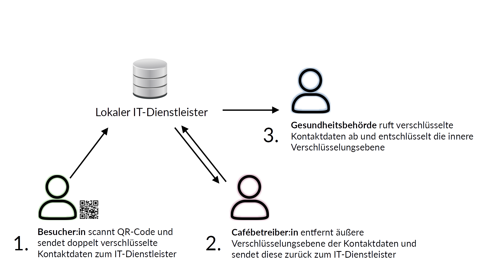
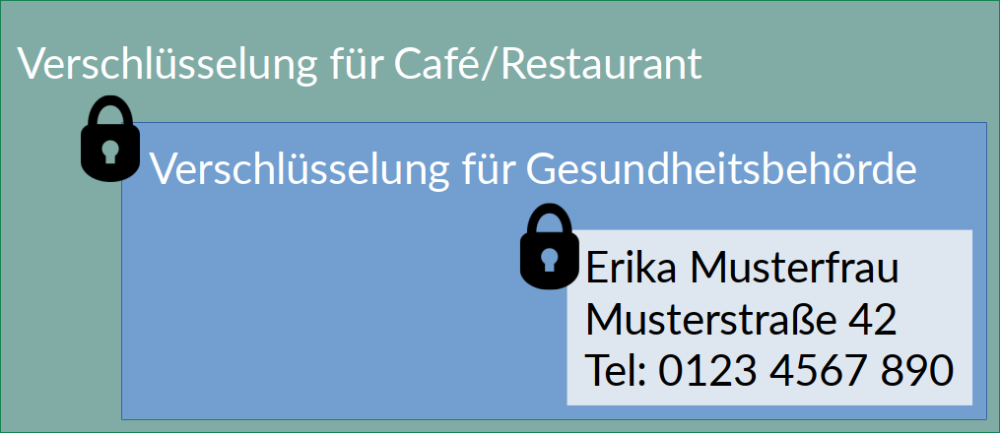

# Digitale Coronaliste
Die Aufrechterhaltung des öffentlichen Lebens erfordert in Zeiten einer globalen Pandemie weitreichende Maßnahmen zur Eindämmung des Virus. Papierhafte Listen zur Erfassung von Kontaktdaten machen die Aufrechterhaltung des Betriebs von Cafés, Restaurants, Geschäften oder anderen öffentlichen Einrichtungen weiterhin (unter Einschränkungen) möglich.

Um das Hinterlegen von Kontaktdaten zu vereinfachen, setzen Cafés, Restaurants und Geschäfte häufig auf digitale Lösungen zur Kontakterfassung. Aktuell schützen diese oft unzureichend vor Datenmissbrauch. Mit unserem System wollen wir eine frei verfügbare Software zur digitalen Kontakterfassung schaffen, die von Grund auf mit dem Ziel entworfen ist, die Kontaktdaten von Kund:innen zu schützen und damit über die Sicherheit von papierhafter Kontakterfassung hinausgeht (d.h. Café-Betreiber:innen erhalten zu keinem Zeitpunkt Zugriff auf die erfassten Daten).

## Das Problem
Analoge Corona-Kontaktlisten in Cafés sind
- anfällig für Datenmissbrauch,
- oft unleserlich,
- für Besucher:innen aufwendig auszufüllen.

### Bisherige digitale Lösungen 
Bestehende Online-Kontaktlisten
- sind oft hastig in bestehende Systeme eingebaut,
- sind daher häufig unsicher (Datenleaks),
- speichern Daten unverschlüsselt in zentralisierten Datenbanken,
- sind herstellergebunden und nicht Open Source.

Statt auf geschlossene Lösungen einzelner Hersteller zu setzen, möchten wir frei verfügbare Software schaffen, die lokalen IT-Dienstleistern die Bereitstellung eines sicheren Systems zur digitalen Erfassung von Kontaktdaten ermöglicht. Datenschutz und Datensicherheit stehen müssen dabei an erster Stelle stehen und im Sinne von Privacy-by-Design direkt von Anfang an bereits in der Konzeptionsphase der Software berücksichtigt werden. Insbesondere setzen wir dabei auf starke Verschlüsselungsverfahren, sodass weder der lokale IT-Dienstleister, noch das Café/Restaurant Zugriff auf die Daten bekommen. Lediglich die anfragende Gesundheitsbehörde erhält nach vorheriger „Freischaltung“ (Entschlüsselung) durch das Café/Restaurant Zugriff auf die hochsensiblen Kontaktdaten der Besucher:innen.

## Die Lösung
Wir brauchen eine **offene Lösung**, die
- Datenstandards und Verschlüsselungsmechanismen als offenen, gut dokumentierten Standard spezifiziert,
- Datenmissbrauch verhindert, indem sie den Zugang zu erhobenen Daten nur durch Café und Gesundheitsbehörde gemeinsam ermöglich,
- als Freie Software für Cafés und IT-Dienstleister zur Verfügung steht (Open Source).

### Systemaufbau (vereinfacht)

### QR-Code
An Orten, an denen Nutzer:innen „einchecken“ können, stellen Betreiber dieser Örtlichkeiten QR-Codes auf. Ein QR-Code enthält einen Link mit der ID der Örtlichkeit und eine Signatur der öffentlichen Schlüssel von Gesundheitsbehörde und Örtlichkeit (Café/Restaurant/etc.).

z.B. `https://corona.example.org/checkin?#sig=0453-1345-1342-5421`

1. Smartphone sendet die Signatur an den Server des lokalen IT-Dienstleisters und erhält zugehörige Daten (öffentliche Schlüssel von Gesundheitsbehörde und Café)
2. Smarthphone prüft Übereinstimmung von Signatur aus QR-Code und empfangenen öffentlichen Schlüsseln.
3. Smartphone verschlüsselt Kontaktdaten mit dem öffentlichen Schlüssel der Gesundheitsbehörde.
4. Smartphone verschlüsselt die bereits verschlüsselten Daten erneut - diesmal mit dem Schlüssel des Cafés.
5. Doppelt verschlüsselte Kontaktdaten werden an den Server gesendet.

Im Falle eines Corona-Verdachts kann der Betreiber eine Ebene der Verschlüsselung der Daten entfernen. Die Gesundheitsbehörde hat anschließend Zugriff auf diese Daten.

### Doppelte Verschlüsselung („Onion encryption“)

Zur Sicherstellung der Vertraulichkeit und zum Schutz vor Datenmissbrauch, werden die Kontaktdaten doppelt verschlüsselt: Die „innere“ Verschlüsselung stellt sicher, dass die Daten nur von der Gesundheitsbehörde im Klartext gelesen werden können und schützt die Daten vor unbefugtem Zugriff durch Dritte. Die „äußere“ Verschlüsselung erlaubt Betreiber:innen des Cafés/Restaurants/... die selektive Gewährung von Zugriffsrechten der Gesundheitsbehörde. Dazu können Betreiber:innen über eine (Web-)Anwendung selektiv die Daten für ein bestimmtes Zeitfenster entschlüsseln und damit der Gesundheitsbehörde den Zugriff auf diese Daten ermöglichen ohne selbst jemals Daten im Klartext verarbeiten zu müssen/können. Zu keinem Zeitpunkt haben Dritte Zugriff auf unverschlüsselte Daten, d.h. insbesondere auch nicht der Betreiber des Online-Dienstes.
